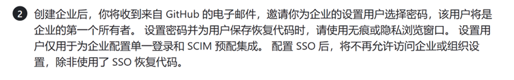
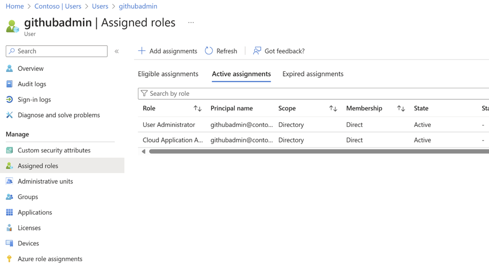
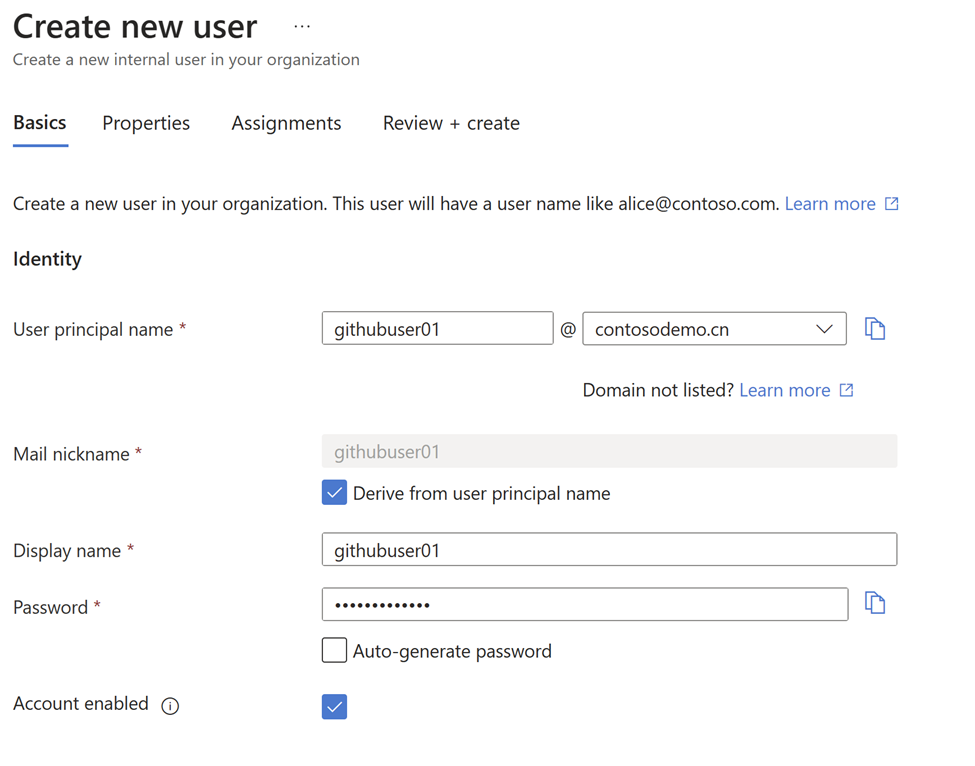
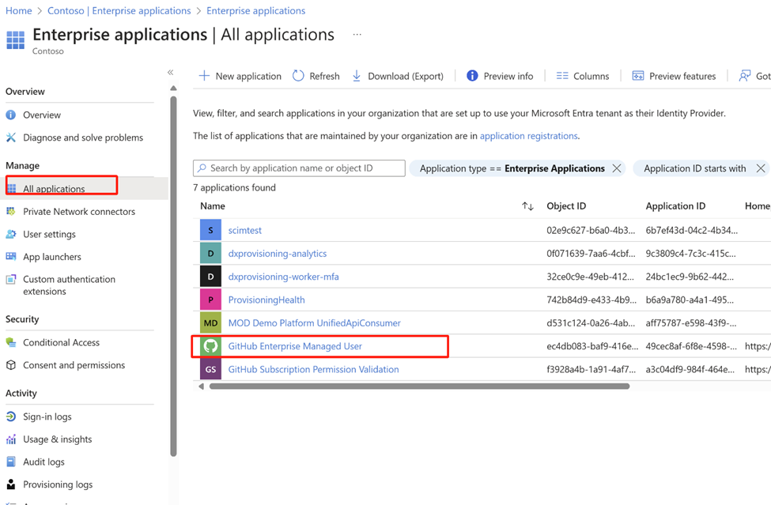
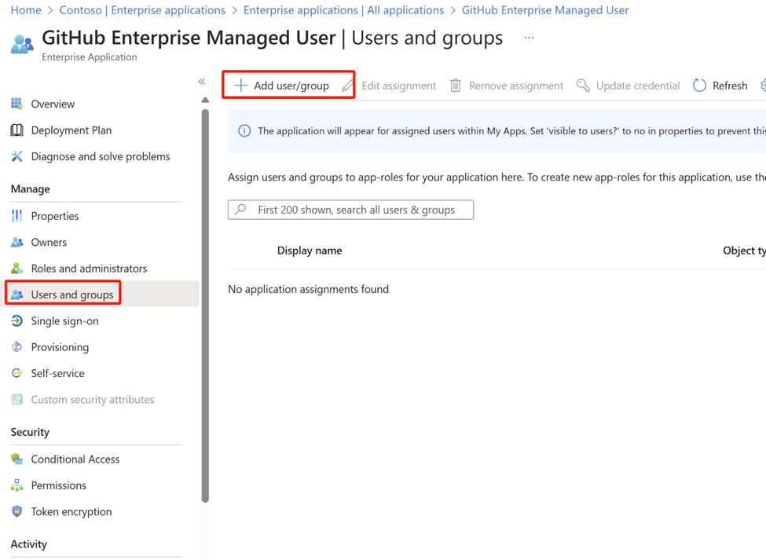
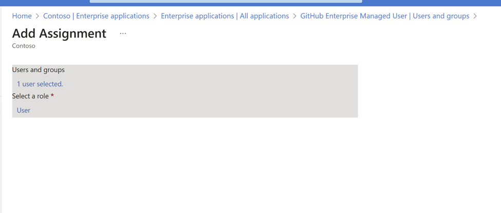
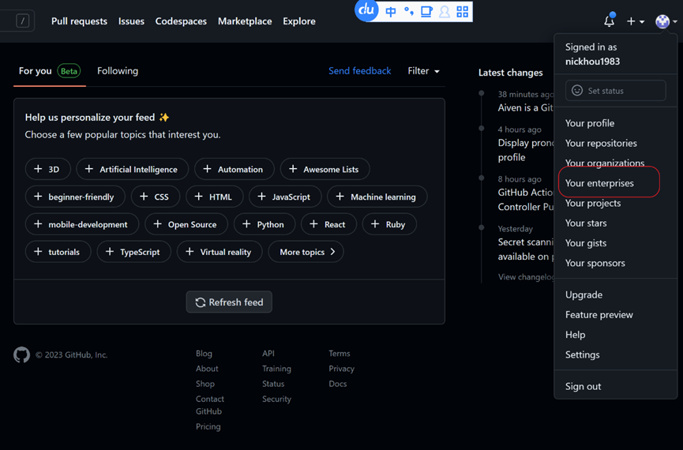
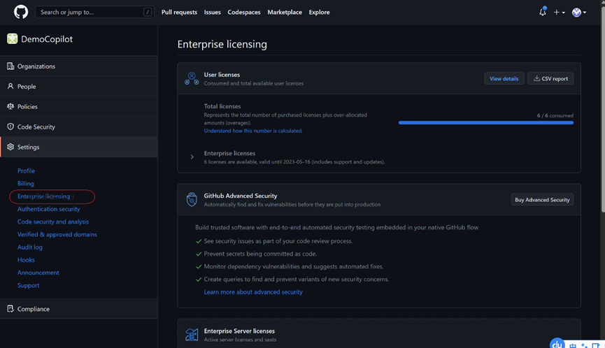
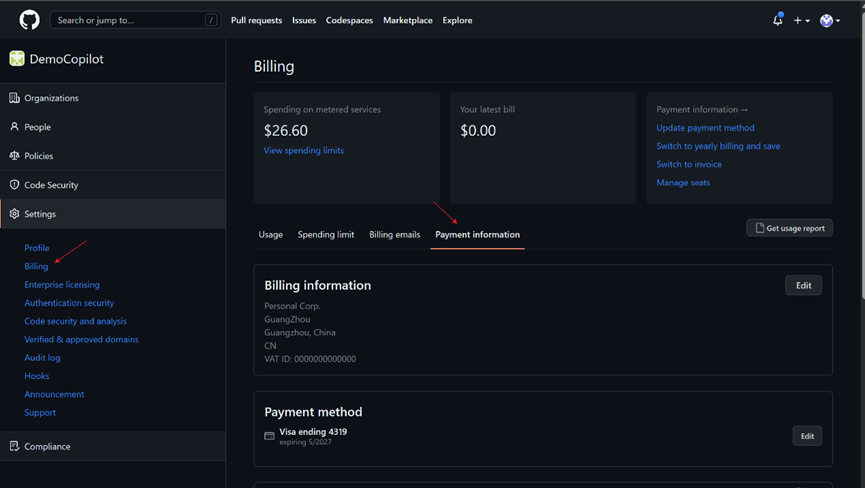

# 1. 先决条件：
* Global Azure AD：用于同步账户到Github， 并提供身份验证；
* Global Azure AD 全局管理员账户：用于配置单点登录
* Global Azure 订阅 ID：用于绑定到Github计费； 
* Azure 订阅管理员：用于配置Github 绑定Azure订阅；

# 2. Github 创建EMU企业
1.	微软售前团队会负责和Github沟通，申请启用EMU企业组织；
2.	客户需提供shortcode （3-8个字符，该代码将用作企业成员用户名的后缀），和管理员邮箱；

# 3. 配置EMU 管理员临时密码
1.	Github 启用EMU企业组织后，会发送激活邮件给到管理员邮箱；
2.	Github 会为EMU企业账户生成一个临时配置管理员，名称为：shortcode_admin
3.	管理员需根据邮箱中的指引，为临时配置管理员创建密码（临时的管理员账户为shortcode_admin）；
* 临时配置管理账户主要用于配置EMU企业组织和AAD集成；
* 请务必使用浏览器隐私模式来为临时管理员账户重置密码和登录；
* 配置了和Azure AD 账户同步后，临时配置管理账户将会失效。请确保下载了临时配置管理员的恢复密钥：

# 4. 选择EMU 身份验证集成方案

| 功能需求 | Global Azure AD | 自建IDP | 说明 |
| --- | --- | --- | --- |
| SAML 2.0 | 已支持 | 必须 | 身份验证 |
| SCIM 2.0 | 已支持 | 必须 | 账户同步 |
| OIDC | 已支持 | 不支持 | 身份验证 |
| 公网访问 | 已支持 | 必须 | 接受Github身份验证请求 |
| 账户同步范围 | 可创建单独的Azure AD或使用现有Azure AD | 将企业内部账户同步到Github（仅同步账户，密码无需同步）| 建议优先考虑Azure AD 方案 |
| 账户同步方式 | 基于用户或基于组（基于组的同步，需要Azure AD P1许可） | 基于用户，基于组同步需IDP提供商提供支持 | 基于组同步，在Azure AD中将用户添加到组后，会自动同步到Github Team中，无需再在Github中将用户添加到Team中 |
| 配置方式 | 内置了对Github的集成，配置简单，无需开发 | 需自建IDP提供商配合调试，可能需要二次开发 | 自建IDP 配置较为复杂，需IDP开发商积极配合 |
| 配置时间 | 小于1小时 | 需自建IDP提供商配合调试，需要评估 | 建议根据实际情况选择方案 |

## 4.1 配置步骤简述

1. 在Azure上创建专用于Github的Global Azure AD或使用现有Azure AD，建议创建Azure AD临时全局管理员，**在配置中需要Azure AD全局管理员账户和密码**；
2. 分别在Github和Azure AD中，配置OIDC/SAML和SCIM集成，**在配置需要Github管理员账户名和密码，Azure AD全局管理员和密码，可使用临时全局管理员和密码**；_---参考4.2 基于Azure AD 配置身份验证集成_
3. 在Github上启用Copilot，绑定到Azure订阅进行计费，**配置过程中需要Azure 订阅ID和Azure订阅管理员和密码**；
4. 如果是新的Azure AD，需首先创建Azure AD用户（可以通过导入CSV文件，批量创建账户）。
如果用户已经存储在Azure AD中，则直接把需要同步的Azure AD 用户或组分配到Github Enterprise Management User应用中，**配置过程中需要 Global Administrator, 或Cloud Application Administrator, 或Application Administrator管理员**；_---参考4.4 同步用户_
5. 如果基于用户同步，用户同步到Github中，需要在Github中将用户添加到启用了Copilot Team中，**配置过程中需要Github管理员账户名和密码**；_---参考4.4 同步用户_
6. 基于组同步，在Azure AD中将用户添加到组后，会自动同步到Github Team中，无需执行第5步操作；_---参考4.2 基于Azure AD 配置身份验证集成_
7. 用户安装IDE插件，使用新用户登录

## 4.2 基于Azure AD 配置身份验证集成
1. 配置OIDC 集成：https://docs.github.com/zh/enterprise-cloud@latest/admin/identity-and-access-management/using-enterprise-managed-users-for-iam/configuring-oidc-for-enterprise-managed-users
2. 配置SCIM 集成：
* 在Github中生成账户同步的票据令牌：https://docs.github.com/zh/enterprise-cloud@latest/admin/identity-and-access-management/provisioning-user-accounts-for-enterprise-managed-users/configuring-scim-provisioning-for-enterprise-managed-users#%E5%88%9B%E5%BB%BA-personal-access-token
* 在Azure AD配置SCIM：https://learn.microsoft.com/en-us/azure/active-directory/saas-apps/github-enterprise-managed-user-oidc-provisioning-tutorial
3. 选择需要同步的用户或组：https://learn.microsoft.com/en-us/entra/identity/enterprise-apps/assign-user-or-group-access-portal?pivots=portal
4. 如果基于用户同步，用户同步到Github中，需要在Github中将用户添加到启用了Copilot的组织中，**配置过程中需要Github管理员账户名和密码**，参考：
https://docs.github.com/zh/enterprise-cloud@latest/admin/managing-accounts-and-repositories/managing-users-in-your-enterprise/managing-organization-members-in-your-enterprise
5. 如果基于组同步，组可以映射到Github Teams中，用户会自动同步到组织中，无需再将Github中将用户添加到组织中，参考：https://docs.github.com/zh/enterprise-cloud@latest/admin/identity-and-access-management/provisioning-user-accounts-for-enterprise-managed-users/managing-team-memberships-with-identity-provider-groups

## 4.3 基于自建IDP 配置身份验证集成
1. SSO 集成配置：https://docs.github.com/zh/enterprise-cloud@latest/admin/identity-and-access-management/iam-configuration-reference/saml-configuration-reference
2. SCIM 集成配置：https://docs.github.com/zh/enterprise-cloud@latest/admin/identity-and-access-management/provisioning-user-accounts-for-enterprise-managed-users/provisioning-users-and-groups-with-scim-using-the-rest-api

## 4.4 在Azure AD 中新建用户，并将用户分配到Github Enterprise Manager User App
### Azure AD 管理员账户需具备如下角色：
* User Administrator：用于创建和管理账户；
* Cloud Application Administrator：用于将账户分配到Github Enterprise Manager User App；

### 配置步骤：
1. 使用Azure AD 管理员账户登录Azure AD，创建用户：

2. 创建用户后，将用户分配到Github Enterprise Management User App中：

默认会在40分钟内将用户同步到Github中；
3. 等用户同步到Github中后，可以在Github中将用户添加到启用了Copilot的组织中，**配置过程中需要Github管理员账户名和密码**.

# 启用Github Copilot
1.	使用Github 企业管理员登录Github；
 
2.	确认License 信息正确；

3.	将Github Enterprise Billing 绑定到Azure 订阅
此操作需Azure 订阅管理员权限；
https://docs.github.com/zh/billing/managing-billing-for-your-github-account/connecting-an-azure-subscription

4.	绑定订阅后，需在企业级别启用Copilot，参考如下文档：
https://docs.github.com/zh/enterprise-cloud@latest/admin/policies/enforcing-policies-for-your-enterprise/enforcing-policies-for-github-copilot-in-your-enterprise#enforcing-a-policy-to-manage-the-use-of-github-copilot-business-in-your-enterprise

